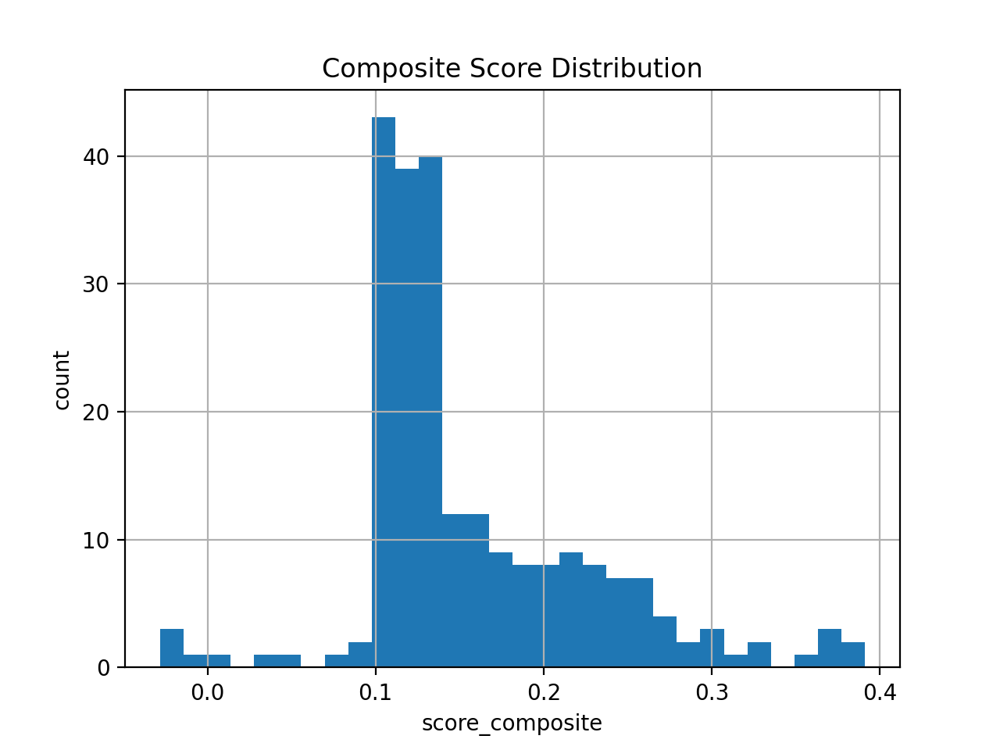
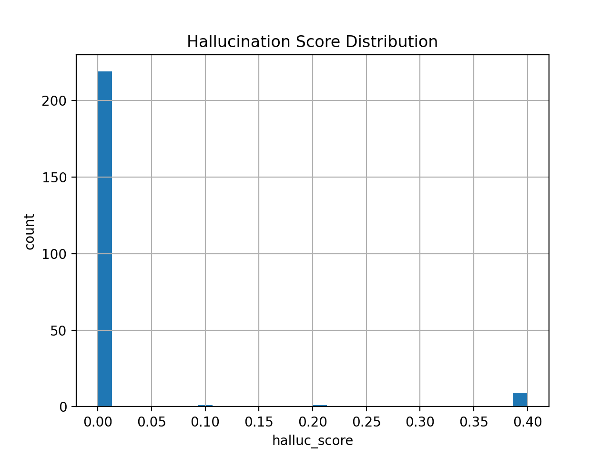
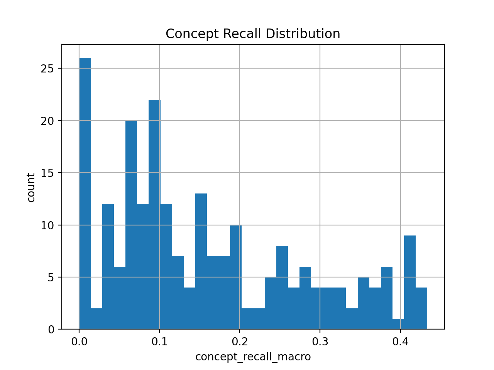
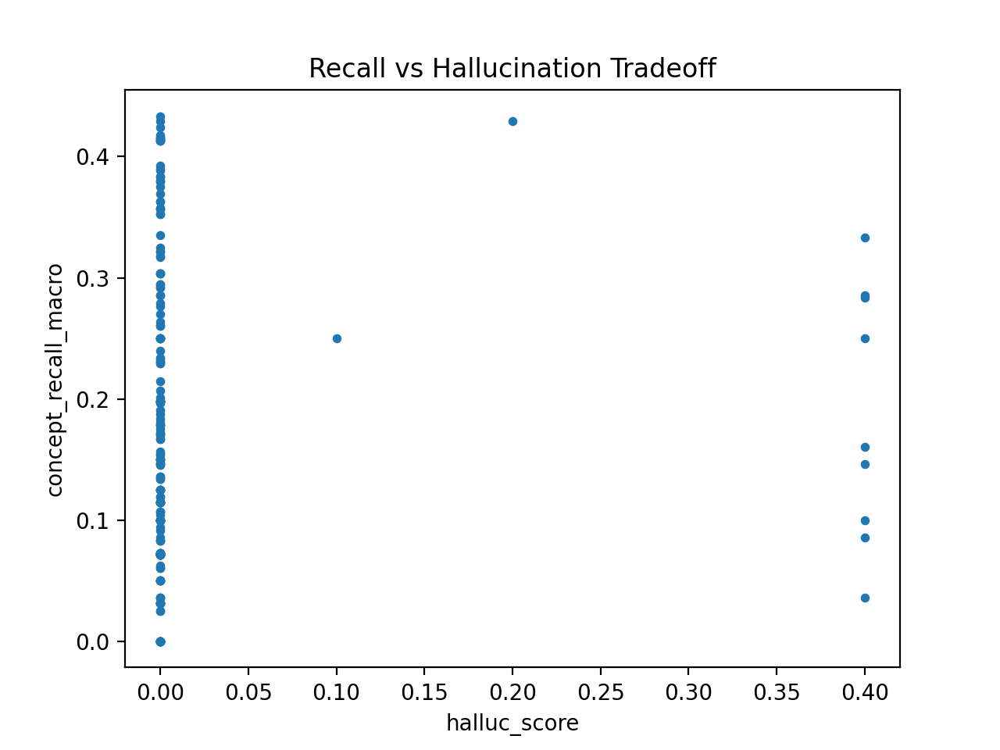

# \# ClaritySOAP  

\## A Safety-Grounded Agentic Workflow for Structured Clinical Documentation using MedGemma


---


## \## Overview


ClaritySOAP is a structured, safety-oriented clinical documentation pipeline built on \*\*MedGemma (HAI-DEF)\*\*.


Instead of prompting a model to freely generate notes, ClaritySOAP reimagines SOAP documentation as a constrained, agentic workflow:


1\. Extract structured clinical state  

2\. Enforce required diagnostic questions  

3\. Ground red flag handling  

4\. Generate strictly formatted SOAP output  

5\. Automatically evaluate safety and completeness  


The system emphasizes:

\- Strict formatting compliance

\- Explicit handling of unknowns

\- Reduced hallucination

\- Measurable completeness


---


## \## Why This Matters


Clinical documentation systems powered by LLMs risk:


\- Missing red flags

\- Skipping required diagnostic questions

\- Hallucinating unsupported clinical facts

\- Producing inconsistent formatting


ClaritySOAP addresses these risks by redesigning SOAP synthesis as a structured, rule-grounded generation pipeline.


---


## \## System Architecture

CASE

↓

Extraction Agent

↓

Structured Clinical State

↓

Template-Grounded MedGemma Agent

↓

Normalization \& Safety Enforcement

↓

Automated Evaluation Engine


## \### Key Design Decisions


\- Required questions must appear verbatim in the SOAP note.

\- Red flags must be explicitly addressed.

\- Missing information is labeled `UNKNOWN`.

\- Output is normalized to strict:

&nbsp; - SUBJECTIVE

&nbsp; - OBJECTIVE

&nbsp; - ASSESSMENT

&nbsp; - PLAN


This prevents format drift and reduces unsafe generation.


---


## \## Quantitative Results


Evaluation performed on 230 synthetic cases.


| Metric | Value |

|--------|-------|

| Parse Success | \*\*0.983\*\* |

| Format Valid | \*\*0.983\*\* |

| Hallucination Score | \*\*0.019\*\* |

| Omission Rate (↓ better) | \*\*0.729\*\* |

| ROUGE-L F1 Macro | \*\*0.169\*\* |

| Concept Recall Macro | \*\*0.271\*\* |

| Composite Score | \*\*0.512\*\* |


The system demonstrates:


\- High structural reliability

\- Low hallucination

\- Improved concept coverage

\- Stable performance across 230 cases


---


## \## Example Figures


\*(Figures saved in artifacts/figures)\*








---

## 

## \## Qualitative Examples


See:

artifacts/samples/qual\_examples.txt


Each example includes:

\- Reference SOAP

\- Generated SOAP

\- Metrics

\- Worst / Median / Best case selection


---

## 

## \## How to Run (Windows / PowerShell)


\### 1. Setup Environment


```powershell

python -m venv .venv

.\\.venv\\Scripts\\Activate.ps1

pip install -r requirements.txt

